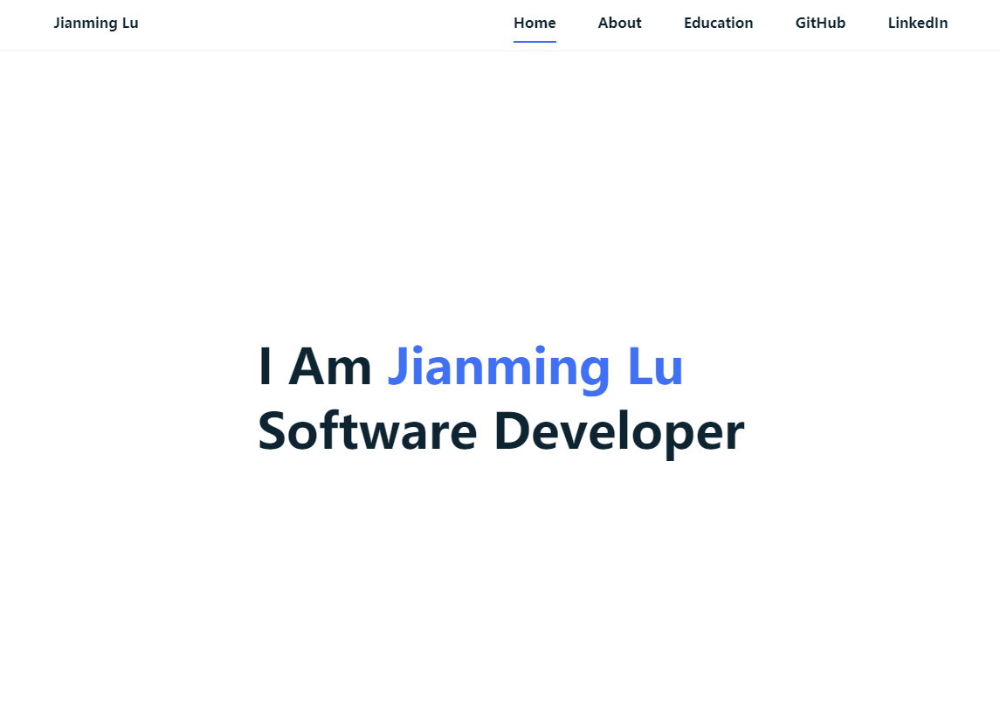

# Jianming Lu Personal Website

## Description
This is Jianming Lu personal website. It includes my brief introduction and my education history. Users can also go to my GitHub page and LinkedIn page by clicking the button on the navbar. This page only has one HTML file. All necessary elements will be placed in different sections.

## Screenshots
- Home

- About

- Eduction

## Requirements and Fulfillments
- A landing page. This is the top page, defined in index.html, which your viewers will land on. It should let people know what the site is about and contain the necessary links and navigation for people to get around the site.
    - Users can see my name on the landing page. On the top right of the page, you could see some navigation buttons which allow users to visit the website.
- One or more navigational elements, such as a header bar, footer bar, or side menu. How you design the navigational element(s) is up to you, but your site should be easy to navigate. There should be no dead ends, and the user should not need to resort to the browser's navigation buttons to get where they want to go. Navigational elements should not scroll out of sight or disappear when the window is resized. Color and positioning of the navigational elements should be styled in CSS.
    - Users could see a navbar on the top of the website, which includes some navigation buttons.
- Two or more internal links. These should link to separate pages or specific HTML elements within your site. For example, a personal page might have an internal link to a "CV" page and another link to a "Hobbies and Interests" page. A company website might have a link to a "Who We Are" page and a "Products and Services" page. The styling of the internal links should match the styling of the rest of the site, and the navigational elements should be present. Internal links should open their content in the same browser tab as the site is being viewed in. The assignment links on our course web page are examples of this.
- On the navbar, users can click the
about button and education button to visit the specific HTML sections.
- One or more external links. The external link(s) should open new browser tabs so that your site remains open in the user's browser. The Blackboard and Piazza links on our course website are examples of this.
    -  On the navbar, users can click the GitHub button and LinkedIn button to visit the external websites.
- At least one HTML table, with CSS styling. Tables enable you to organize elements into columns and rows. Tables are a great way to display work or education history on a CV, or to constrain components (such as images and corresponding text) to display in rows. The schedule on the landing page of our course website is an example of table layout. With CSS, you can control spacing, borders (or lack of) and other visual aspects.
    - In the education section, users can see my education history table.
- At least one interactive or animated component. Use jQuery or vanilla JS to give your website a little flair by having an animated menu, resizable item, or interactive highlighting. The way the rows of the schedule on our class syllabus page turn gray when the mouse is over them is a subtle example of how something like this can be used.
    - On the navbar, when the mouse is over navigation buttons, navigation buttons will have the underline. Also, when the mouse is over the table, the table row will have the animation.
- Attention to responsiveness. Your site should behave in a reasonable way when viewed on a desktop in a browser, and on a mobile device. Use CSS media queries to make sure that your site looks okay on different sized displays. You can simulate a device display using your browser's development tools. It is also possible to view your website running on localhost in another device on the same network by using the server's IP address as the URL. (The IP address to use is the one that http-server tells you it is serving to, which is not 127.0.0.1).
    - This website uses a responsive layout. Users can view it on their mobile devices. CSS media queries can be found in the styles.css in the CSS folder.

